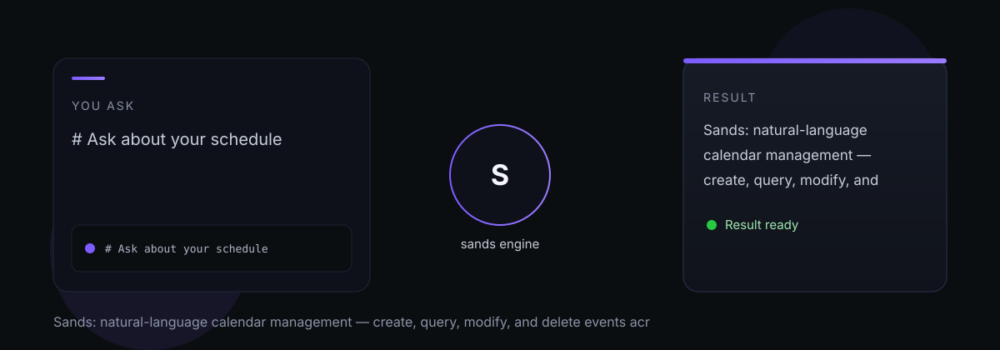

# sands

sands — Sands: natural-language calendar management — create, query, modify, and delete events across multiple calendars.

> Tell it what you need. It does the work.

## What it does

Sands treats your calendar as a structured scheduling surface. It reads across personal and work calendars (work events shown only as busy blocks, titles suppressed), resolves natural-language time references to precise ISO 8601 ranges, and handles recurring events with scope control. Travel time blocks are computed via Google Places Distance Matrix API. Every action is logged with undo support within 24 hours.

## Dependencies

- [Weave](https://github.com/indigokarasu/weave) — attendee identity resolution
- [Elephas](https://github.com/indigokarasu/elephas) — current location context
- [Vesper](https://github.com/indigokarasu/vesper) — consumes schedule briefs
- [Voyage](https://github.com/indigokarasu/voyage) — travel reservations surfaced to Voyage
- Google Calendar API, Google Places API

---

*sands is part of the [OCAS Agent Suite](https://github.com/indigokarasu).*